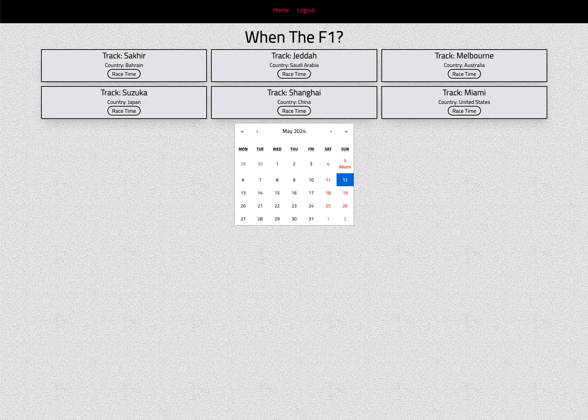

# When the F1

A glorified timezone converter version for Formula 1 races throughout the season.

Users need to sign up for an account and log in to see race information such as location, track name, and race start time (automatically converted to the user's current location).

Technologies for the backend of "When the F1" include Ruby on Rails, PostgreSQL database, React.js, and most importantly the OpenF1 open source API.



## Installation

```bash
npm install
```

## Usage

```bash
npm run dev
```

Make sure that the frontend is running on http://locahost:5173.
Backend should be running on http://localhost:3000.

## Roadmap

Upcoming features include:
- Weather information for each race
- Dedicated section for driver and constructor standings throughout the season.
- Additional visual improvements
